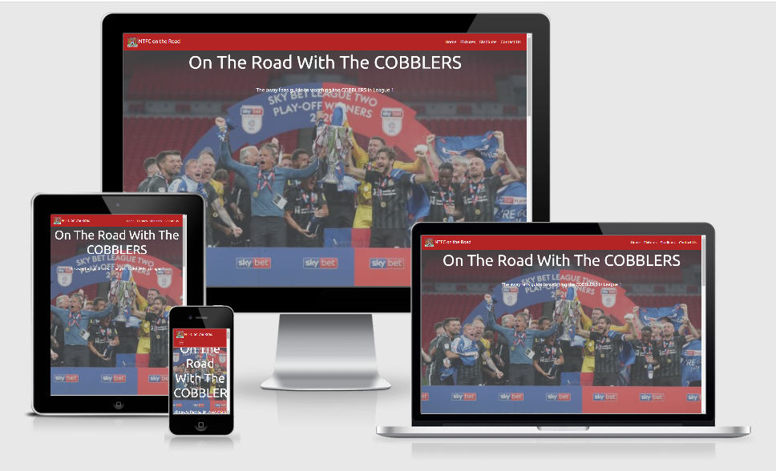

<h1 align = "center">On the road with the Cobblers<h1>

## Milestone 2 Project: Interactive Frontend Development by Martin Johnson

On The Road With The Cobblers is an interactive front end website designed and built by Martin Johnson using knowledge
learnt on the Code Institute Full Stack Developers Course Modules 1- 7 which include HTML, CSS and JavaScript.

It is a fully responsive site designed to met the users requirements first.

The purpose of the site is to provide football supporters with fixture details, club infomation and travel directions. This 
site is primarily focused for supporterss of Northampton Town FC , however the fundamental design and content can be adapted 
for clubs and other sports.

[View the live project here.](https://martinjohnson26.github.io/Milestone2-Project/)

## User Experience (UX)

As a regular follower of Northampton Town FC , I was inspired to create an interactive website for fellow supporters 
that is easy to use , provided fixture detail infomation, locations of the grounds they may want to visit and directions
to those grounds. The site should also be mobile friendly as predicted usage is likely to be on match days when the user
 does not have easy access to a laptop.

 - As a user, I want to be able to see fixtures dates and kick off times
 - As a user, i want to see details of the stadiums that I am going to and details about the other teams in my league
 - As a user, I want to be able to get directions to the stadiums
 - As a user, I want to be able to contact the site owner and ask for more information

 - As site owner, I want to provide the infomation supports require in a clear and easy to use style
 - As site owner, I want to be able to respond to user requests and share my knowledge and experience with the user

 ## Wireframes

 Based on user requirements, I used [Balsamiq](https://balsamiq.com/) to create basic site layout templates for desktop,
 tablet and mobile devices . The design consists of 4 sections , a home page, a fixtures section, a map section and a 
 contact section. I decised to use a JQuery toggle function to show and hide the fixtures as selected by the user. A gallery 
 page was consider but deemed not relevant at the design inception and with this in mind the a single page website was decided
 upon. 
 initial Home page design layouts are displayed below. [Full wireframes can be viewed here](assets/readme_docs/wireframes/wireframes.pdf)

 

