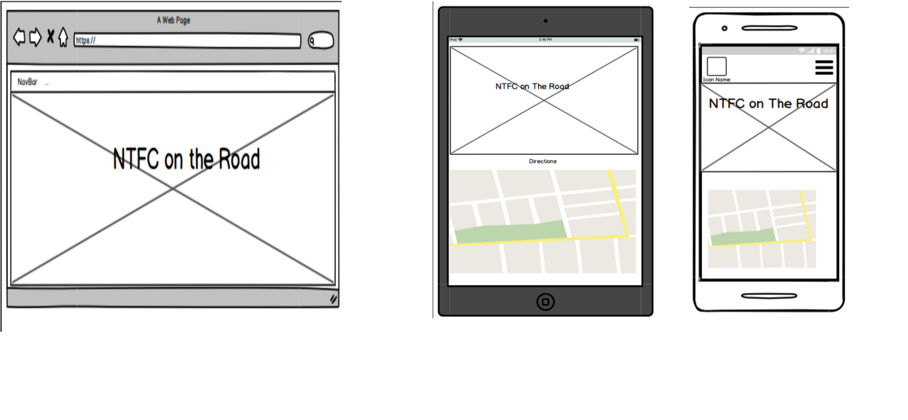

<h1 align = "center">On the road with the Cobblers<h1>

## Milestone 2 Project: Interactive Frontend Development by Martin Johnson

On The Road With The Cobblers is an interactive front end website designed and built by Martin Johnson using knowledge
learnt on the Code Institute Full Stack Developers Course Modules 1- 7 which include HTML, CSS and JavaScript.

It is a fully responsive site designed to met the users requirements first.

The purpose of the site is to provide football supporters with fixture details, club infomation and travel directions. This 
site is primarily focused for supporterss of Northampton Town FC , however the fundamental design and content can be adapted 
for clubs and other sports.

[View the live project here.](https://martinjohnson26.github.io/Milestone2-Project/)

## User Experience (UX)

As a regular follower of Northampton Town FC , I was inspired to create an interactive website for fellow supporters 
that is easy to use , provided fixture detail infomation, locations of the grounds they may want to visit and directions
to those grounds. The site should also be mobile friendly as predicted usage is likely to be on match days when the user
 does not have easy access to a laptop.

 - As a user, I want to be able to see fixtures dates and kick off times
 - As a user, i want to see details of the stadiums that I am going to and details about the other teams in my league
 - As a user, I want to be able to get directions to the stadiums
 - As a user, I want to be able to contact the site owner and ask for more information

 - As site owner, I want to provide the infomation supports require in a clear and easy to use style
 - As site owner, I want to be able to respond to user requests and share my knowledge and experience with the user

 ## Wireframes

 Based on user requirements, I used [Balsamiq](https://balsamiq.com/) to create basic site layout templates for desktop,
 tablet and mobile devices . The design consists of 4 sections , a home page, a fixtures section, a map section and a 
 contact section. I decised to use a JQuery toggle function to show and hide the fixtures as selected by the user. A gallery 
 page was consider but deemed not relevant at the design inception and with this in mind the a single page website was
 decided upon.

 Initial Home page design layouts are displayed below. [Full wireframes can be viewed here](assets/readme_docs/wireframes/wireframes.pdf)

 

    ### Strategy

    To create a simple and attractive site for supporters of Northampton Town FC

    ### Scope

    To provide fixtures and stadium details and travel directions for supporters. 

    ### Structure

    The site is structured to ensure that all elements of the site are easily accessible via a navigation bar and is layed
    out in clearly defined sections for the user

    ### Skelton

    The initial design layout was created using [Balsamiq](https://balsamiq.com/). The designs are shown above in the
    Wireframes section

    ### Surface

    A team image with an opacity added to enable the text to be more visible is the landing page.
    
 ## Design and Website Features

    ### Initial Design

    The initial design was created in Balsamiq. A single page site was chosen containing four sections

-   ### Colour scheme

    Claret and White have been used as the prominent colours for fonts and backgrounds on navbars and footers as they
    represent the club colours. A pale yellow has been used for hover effects again representing the clubs second chioce
    colours. A light grey background was used to enhance the overall feel to the site.

    * Fonts,NavBar and footer backgrounds:  #b42424
      Fixture Section Fonts: #000000
      Hover effects: #E1F85E
      Body: #eaeae1

-   ### Typography

    Ubuntu was the chosen font for its clear and easily readable text and strong characters when used with a bold font.
    Sans Serif has been selected as the fallback text should the main font fail to import correctly for any reason.

-   ### Images

    An image of the team celebrating their promotion success at Wembley has been chosen for the landing page, with a opacity
    added to enable the text to be more visible.

-   ### Site Features

    * Navigation: Permits the user to navigate to all sections of the site in a simply manner and return to the Home page
    from anywhere on the page by selecting the Home menu or by selecting the NavBar brand name or logo.

    * Fixtures Section: Opponents are listed alphabetically in sequence. Each club has a 'Show Fixtures' button which when
     selected reveals fixture dates , kick off times and stadiums. The background for each club is based on the clubs
     traditional colours. The fixtures can be hidden after viewing by clicking on the 'Hide Fixtures"button.

    * Google Maps API: Using a Google Map API the Twenty Four teams in the league have been coded to display a location
     marker. Users can scroll in and out of the map and select a marker . The marker will display an info window displaying
     an image of the stadium. Within the info window are two links. One links to the clubs official website and the other
     open a google maps directions window.

    * Contact Form: A simple contact form is used to enable the user to contact the site owner via e-mail.

    * Social Media: Links to usual social media sites are included in the footer section.

    ### Future Implimentations

    * Add a search bar to the Map to enable users to search for specific needs in the vicinity of the stadiums (bars, food
     outlets etc).
    * Add a new section, possibly a blog page, that would allow users to add reviews and comments about their visit to
     the stadiums.

##  Technologies used

* [HTML](https://html.com/)  
* [CSS](https://www.w3schools.com/css/)  
* [Bootstrap](https://getbootstrap.com/) (https://bootstrapbay.com/blog/14-days-bootstrap-4/)
* [Google Maps API](https://developers.google.com/maps/documentation)
* [EmailJS](https://www.emailjs.com/)
* [JavaScript](https://www.javascript.com/) 
* [JavaQuery](https://jquery.com/)
* [GitHub](https://github.com/)
* [GitPod](https://www.gitpod.io/)
